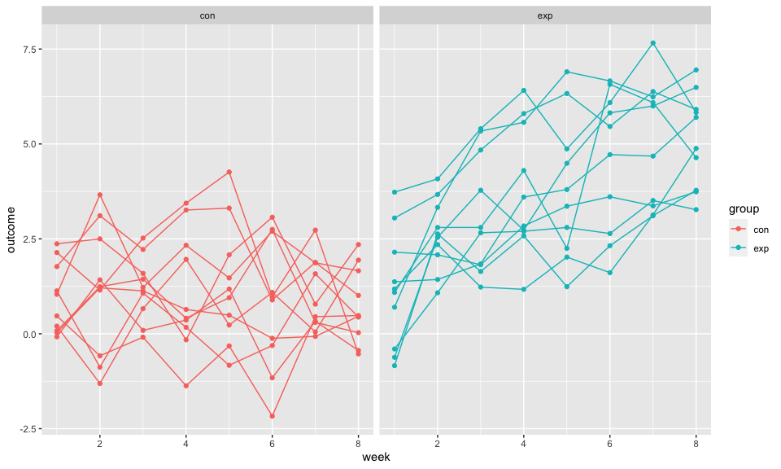

p8105_hw5_td2749
================
Tvisha R. Devavarapu
2022-11-03

``` r
library(tidyverse)
library(ggplot2)

knitr::opts_chunk$set(
  fig.width = 10,
  fig.asp = .6,
  out.width = "90%"
)
```

# Problem 1: Files

``` r
full_df = 
  tibble(
    files = list.files("data/zip_data/"),
    path = str_c("data/zip_data/", files)
  ) %>% 
  mutate(data = map(path, read_csv)) %>% 
  unnest()
```

    ## Warning: `cols` is now required when using unnest().
    ## Please use `cols = c(data)`

``` r
tidy_df = 
  full_df %>% 
  mutate(
    files = str_replace(files, ".csv", ""),
    group = str_sub(files, 1, 3)) %>% 
  pivot_longer(
    week_1:week_8,
    names_to = "week",
    values_to = "outcome",
    names_prefix = "week_") %>% 
  mutate(week = as.numeric(week)) %>% 
  select(group, subj = files, week, outcome)
```

``` r
tidy_df %>% 
  ggplot(aes(x = week, y = outcome, group = subj, color = group)) + 
  geom_point() + 
  geom_path() + 
  facet_grid(~group)
```



# Problem 2: Homicide Data

``` r
homicide_data = 
  read_csv("./data/homicide-data.csv") %>%
  janitor::clean_names() %>% 
    unite(city_state, c(city, state), sep = ",", remove = FALSE) %>% 
    group_by(city_state, disposition) %>% 
      summarize(cases = n()) %>%
      pivot_wider(names_from = disposition, values_from = cases) %>% 
      janitor::clean_names() %>% 
      replace(is.na(.), 0) %>% 
      mutate(total_cases = closed_by_arrest + closed_without_arrest + open_no_arrest) %>% 
      mutate(unsolved_cases = closed_without_arrest + open_no_arrest) %>% 
      select(city_state, unsolved_cases, total_cases)
```

    ## Rows: 52179 Columns: 12
    ## ── Column specification ────────────────────────────────────────────────────────
    ## Delimiter: ","
    ## chr (9): uid, victim_last, victim_first, victim_race, victim_age, victim_sex...
    ## dbl (3): reported_date, lat, lon
    ## 
    ## ℹ Use `spec()` to retrieve the full column specification for this data.
    ## ℹ Specify the column types or set `show_col_types = FALSE` to quiet this message.
    ## `summarise()` has grouped output by 'city_state'. You can override using the `.groups` argument.

``` r
head(homicide_data)
```

    ## # A tibble: 6 × 3
    ## # Groups:   city_state [6]
    ##   city_state     unsolved_cases total_cases
    ##   <chr>                   <int>       <int>
    ## 1 Albuquerque,NM            146         378
    ## 2 Atlanta,GA                373         973
    ## 3 Baltimore,MD             1825        2827
    ## 4 Baton Rouge,LA            196         424
    ## 5 Birmingham,AL             347         800
    ## 6 Boston,MA                 310         614

**Raw Data Description**: The raw data consists of 51 rows of
observations and 3 columns of variables. Each row identifies a distinct
homicide victim’s information. The variables are city_state,
unsolved_cases, total_cases. From these pieces of information, we get a
picture of each victim’s personal details, date of the homicide,
location, and the disposition of the case. There are some missing values
(NA) in the latitude and longitude columns. Most columns contain
character values. Several cells in the `race`, `age`, and `sex` columns
contain ‘Unknown’, reflecting the missing information regarding the
specific individuals. There are some cities (Boston, Los Angeles,
Louisville, Oakland, and Pittsburgh) where there are no cases labelled
as “closed without arrest”.

``` r
balt_x = homicide_data %>% filter(city_state == "Baltimore,MD") %>% pull(unsolved_cases)
balt_n = homicide_data %>% filter(city_state == "Baltimore,MD") %>% pull(total_cases)

baltimore_proptest = 
  prop.test(balt_x, balt_n) %>% 
  broom::tidy()

# balt_unsolved_prop
baltimore_proptest %>% pull(estimate)
```

    ##         p 
    ## 0.6455607

``` r
# balt_lower_bound
baltimore_proptest %>% pull(conf.low)
```

    ## [1] 0.6275625

``` r
# balt_upper_bound
baltimore_proptest %>% pull(conf.high)
```

    ## [1] 0.6631599

``` r
homicide_prop_results =
  homicide_data %>% 
    mutate(
      result = purrr::map2(.x = unsolved_cases, .y = total_cases, ~broom::tidy(prop.test(x = .x, n = .y)))
      ) %>%
    unnest(result) %>% 
    select(city_state, unsolved_cases, total_cases, estimate, conf.low, conf.high) %>% 
    rename(unsolved_prop = estimate) %>% 
    mutate(conf_int = paste("(", round(conf.low, 3), ",", round(conf.high, 3), ")")) %>% 
    select(city_state, unsolved_cases, total_cases, unsolved_prop, conf_int, conf.low, conf.high)
```

    ## Warning in prop.test(x = .x, n = .y): Chi-squared approximation may be incorrect

**NOTE**: The warning message reveals that chi-square approximation may
be incorrect for “city_state = Tulsa,AL”. This is because this group
only contains 1 homicide case (total) and 0 unsolved cases. As there is
no scenario of an unsolved cases proportion (0/1) here and as the total
number of cases is only 1, it is not appropriate to perform a one-sample
proportion test under these circumstances. Due to this reason, this
observation is *excluded* from the plot below.

``` r
unsolved_prop_plot = 
  homicide_prop_results %>%
  filter(city_state != "Tulsa,AL") %>% 
    ggplot(aes(x = reorder(city_state, unsolved_prop), y = unsolved_prop)) +
      geom_point() +
      geom_errorbar(aes(ymin = conf.low, ymax = conf.high)) +
      labs(title = "Proportion of Unsolved Homicides by City (2007-2017)",
           x = "Location (City and State)",
           y = "Proportion of Unsolved Homicide Cases",
           caption = "Proportions of unsolved homicides with associated 95% confidence intervals between 2007 and 2017 in major US cities.") +
      theme(plot.title = element_text(hjust = 0.5, face = "bold"),
            plot.caption = element_text(hjust = 0.5),
            axis.title = element_text(face = "bold"),
            axis.text.x = element_text(angle = 70, hjust = 1))

unsolved_prop_plot
```


# Problem 3: Simulation

``` r
set.seed(1)
```

``` r
output_0_mu = vector("list", 5000)

for (i in 1:5000) {
  output_0_mu[[i]] = broom::tidy(t.test(rnorm(n = 30, mean = 0, sd = 5), mu = 0, conf.level = 0.95))
}

output_0_mu_df = 
  bind_rows(output_0_mu) %>% 
  select(estimate, p.value) %>% 
  rename(obs_mu = estimate, p_value = p.value)

head(output_0_mu_df)
```

    ## # A tibble: 6 × 2
    ##   obs_mu p_value
    ##    <dbl>   <dbl>
    ## 1  0.412  0.629 
    ## 2  0.664  0.368 
    ## 3  0.551  0.534 
    ## 4  0.567  0.487 
    ## 5 -1.65   0.0599
    ## 6  1.19   0.229

``` r
norm_and_t_test = function(mu) {
  
  if (!is.numeric(mu)) {
    stop("The mean (mu value) should be numeric")}
  
  sim_data = tibble(
    x = rnorm(n = 30, mean = mu, sd = 5),
  )
  
  sim_data %>%
    summarize(broom::tidy(t.test(x, mu = 0, conf.level = 0.95, alternative = "two.sided"))) %>% 
    select(estimate, p.value) %>% 
    rename(obs_mu = estimate, p_value = p.value)
    
}
```

``` r
sim_results_df = 
  expand_grid(
    mu = c(0, 1, 2, 3, 4, 5, 6),
    iteration = 1:5000) %>% 
  mutate(results = map(mu, norm_and_t_test)) %>% 
  unnest(results)
```

``` r
sim_results_df %>% 
  mutate(indicator = case_when(p_value < 0.05 ~ "reject",
                               p_value >= 0.05 ~ "fail_to_reject")) %>% 
  group_by(mu, indicator) %>%
  summarize(counts = n()) %>% 
  pivot_wider(names_from = indicator, values_from = counts) %>% 
  replace(is.na(.), 0) %>%
  mutate(total = fail_to_reject + reject,
         reject_prop = reject/total) %>% 
    ggplot(aes(x = as.factor(mu), y = reject_prop)) + 
      geom_point() +
      labs(title = "Power vs. True Mean",
           x = "True Mean",
           y = "Power") +
      theme(plot.title = element_text(hjust = 0.5, face = "bold"),
            plot.caption = element_text(hjust = 0.5),
            axis.title = element_text(face = "bold"))
```

    ## `summarise()` has grouped output by 'mu'. You can override using the `.groups`
    ## argument.


**Association between effect size and power**: As the effect size
increases, the power also increases. i.e there is a directly
proportional relationship between effect size and power. In this
particular case, in our t-tests, we consider the following hypothesis:
\* Ho : True mean is 0 \* H(alternative): True mean is NOT 0. In this
set up, as we go from true mean is 0 to 1 to 2 to 3 onwards, the effect
size keeps going up as the distance between the hypothesized mean (0)
and the true mean (0/1/2/3/4/5/6) increases. When the true mean is 6, in
a repeated trial set up with 5000 trials and a normally generated sample
of size 30, the chances of ending up with an observed mean that is
actually \~0 are extremely low. Due to this, the proportion of times the
null hypothesis (mean is 0) is rejected is therefore high (almost all
observed means are \~6 and not \~0 and so, almost all t-tests result in
rejections of the null hypothesis). The opposite is the case when the
true mean is the same as the hypothesized mean (0 and 0). Here, the
effect size is extremely minimal as most of the observed means are set
to be around 0. As a result the null hypothesis holds true and there are
no rejections made, revealing a low proportion of null hypothesis
rejections, i.e low power.

In cases where the null hypothesis is false, we ideally want to reject
them. Which is that based on the context of our study, we would
prioritize our experimental designs to have high power.

``` r
sim_results_df %>% 
  group_by(mu) %>% 
  mutate(overall_avg_obs_mu = sum(obs_mu)/n()) %>% 
  mutate(indicator = case_when(p_value < 0.05 ~ "reject",
                               p_value > 0.05 ~ "fail_to_reject")) %>% 
  group_by(mu, indicator, overall_avg_obs_mu) %>% 
  summarize(avg_obs_mu = sum(obs_mu)/n()) %>% 
  pivot_wider(names_from = indicator, values_from = avg_obs_mu) %>% 
  replace(is.na(.), 0) %>%
  rename(avg_obs_mu_reject = reject) %>% 
  select(-fail_to_reject) %>% 
  pivot_longer(overall_avg_obs_mu:avg_obs_mu_reject, names_to = "condition", values_to = "avg_obs_mu_val") %>% 
    ggplot(aes(x = as.factor(mu), y = avg_obs_mu_val)) +
      geom_point(aes(color = condition, shape = condition)) +
      labs(title = "Overall and Rejected Mu Vs. True Mu",
           x = "True Mu",
           y = "Observed Mu") +
      theme(plot.title = element_text(hjust = 0.5, face = "bold"),
            plot.caption = element_text(hjust = 0.5),
            axis.title = element_text(face = "bold"))
```

    ## `summarise()` has grouped output by 'mu', 'indicator'. You can override using
    ## the `.groups` argument.


**Is the sample average of the observed mu across tests for which the
null is rejected approximately equal to the true value of mu? Why or why
not?**: The sample average of the observed mu across tests for which the
null is rejected is not approximately equal to the true value of mu for
every mu. As the value of true mu increases, the sample average of the
observed mu across tests for which the null is rejected converges to the
true mu. \* When the true mu is 0, the avg value of the rejected is
actually quite close. This could actually be anything but as we have a
large trial number (5000) and the values are generated from normal
samples of size 30, the averages end up going towards the true mean. \*
As the value of the true mean keeps increasing, most cases gradually
involve the rejection of the null hypothesis (true mean = 0), which is
why for true mu 5 and 6, the sample average of the observed mu in
rejected cases is the same as the true mu .
